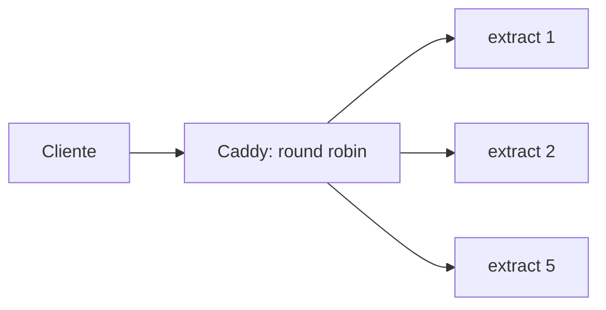

# extract-service (v1.0)

Microservicio sin estado que extrae el texto de un PDF. Trabajo práctico de Desarrollo de Software (UTN Facultad Regional San Rafael): test de carga, estrés y optimización.

Las mediciones, las decisiones de diseño y el análisis del cuello de botella están en [`docs/informe.md`](docs/informe.md).

## Inicio rápido

Requisitos: Docker con Compose v2 (se usa `--wait`) y unos 4 GB de RAM libres. Las 5 réplicas tienen un tope de 1 GiB cada una; en la práctica usan bastante menos.

```bash
git clone https://github.com/juandelosrios124/extract-service.git
cd extract-service
git checkout v1.0
docker compose up --build -d --wait
```

Levanta **5 réplicas** (1,0 CPU y 1 GiB cada una) detrás de Caddy, publicado en `http://localhost:8001`.

Probar un pedido:

```bash
curl -s -H "Content-Type: application/pdf" --data-binary @tests/stress/pdfs/Filosofia_Lean.pdf http://localhost:8001/extract | head -c 300
```

En PowerShell: `curl.exe -s -H "Content-Type: application/pdf" --data-binary "@tests/stress/pdfs/Filosofia_Lean.pdf" http://127.0.0.1:8001/extract`.

Estado y limpieza:

```bash
docker compose ps        # 5 réplicas "healthy" y el proxy
docker compose down
```

## API

| Método | Ruta | Descripción |
|---|---|---|
| POST | `/extract` | Recibe un PDF como cuerpo binario (`Content-Type: application/pdf`) o como `multipart/form-data` (campo `file`) y responde `{"content": "...", "page_count": N}`. `content` es texto plano |
| GET | `/health` | Estado del servicio |

Errores: `400` (sin PDF o PDF inválido), `413` (supera `MAX_UPLOAD_SIZE`) y `503` con `Retry-After: 1` cuando el servicio está saturado (sin cupo o pedido vencido). Un `503` indica reintentar más tarde; no es una falla del servicio.

## Configuración y valores por defecto

Todo se configura por variables de entorno (Twelve-Factor). Los valores por defecto ya están en `docker-compose.yml` y documentados en `.env.example`. Para cambiarlos, copiá `.env.example` a `.env` o exportá la variable antes de `docker compose up`. Los valores por defecto del código (cuando se ejecuta fuera de Compose) están en `extractor/config.py` y pueden diferir.

| Variable de Compose | Valor | Por qué |
|---|---|---|
| `EXTRACT_REPLICAS` | `5` | Máximo permitido por la consigna |
| `EXTRACT_CPUS` | `1.0` | Límite de CPU por réplica pedido por la consigna; define cuántos hilos conviene usar |
| `EXTRACT_MEMORY` | `1g` | Tope de la consigna (512 MB a 1 GB); el uso real es mucho menor |
| `EXTRACT_THREAD_POOL_SIZE` | `1` | Un worker por núcleo asignado. La extracción consume CPU: con 4 hilos sobre 1,0 CPU solo había contención y latencias de 22 s o más |
| `EXTRACT_MAX_CONCURRENT_UPLOADS` | `8` | Cada réplica atiende como máximo 8 pedidos a la vez; acota la memoria y evita acumular pedidos que van a expirar |
| `EXTRACT_UPLOAD_SLOT_TIMEOUT` | `15` | Segundos que un pedido espera un cupo (sin leer el cuerpo) antes de recibir `503`. Menos de la mitad del timeout de 30 s del cliente |
| `EXTRACT_MAX_QUEUE_WAIT` | `20` | Si un pedido ya esperó 20 s antes de empezar a extraer, se descarta con `503` sin gastar CPU |
| `EXTRACT_MAX_UPLOAD_SIZE` | `52428800` | 50 MiB; el cuerpo se corta apenas se supera |
| `EXTRACT_LOG_LEVEL` | `INFO` | Logs a stdout |
| `PROXY_PORT` | `8001` | Puerto publicado |

Los timeouts de Caddy (`PROXY_DIAL_TIMEOUT`, `PROXY_TRY_DURATION`, `PROXY_RESPONSE_TIMEOUT`, `PROXY_READ_BODY_TIMEOUT`, `PROXY_WRITE_TIMEOUT`, `PROXY_IDLE_TIMEOUT`) también son variables; ver `.env.example`.

**Por qué esta configuración.** En la prueba de la cátedra (Vegeta, 50 req/s durante 30 s) la configuración sin límites logró 68,93 % de éxito y 17,30 req/s; con el límite de 8 por réplica, **76,13 % y 20,06 req/s**, con 262 timeouts contra 465 y 96 respuestas `503` controladas. La referencia de la cátedra es 66,53 % y 16,65 req/s. Los valores 8, 15 s y 20 s son un primer ajuste razonado, no un óptimo: ver el informe.

Para reproducir la configuración **sin límites** (A):

```bash
EXTRACT_MAX_CONCURRENT_UPLOADS=0 EXTRACT_MAX_QUEUE_WAIT=1000 docker compose up -d --force-recreate --wait
```

En PowerShell: `$env:EXTRACT_MAX_CONCURRENT_UPLOADS="0"; $env:EXTRACT_MAX_QUEUE_WAIT="1000"; docker compose up -d --force-recreate --wait`.

## Arquitectura



Cada réplica admite como máximo `MAX_CONCURRENT_UPLOADS` pedidos, lee el cuerpo en memoria (sin escribir a disco) y extrae el texto con PyMuPDF en un pool de hilos separado del event loop. Decisiones principales:

- **PyMuPDF** y no `pypdfium2`: esta fue solo un 11,4 % más rápida, por debajo del 15 % que el equipo fijó para justificar el riesgo de cambiar.
- **Un hilo por réplica**, porque cada contenedor tiene 1,0 CPU.
- **Backpressure** con `503` y `Retry-After`, para fallar rápido en lugar de acumular pedidos.

Capas: `extractor/api` (HTTP), `extractor/services` (extracción, sin conocer HTTP) y `extractor/main.py` (composición).

## Tests

```bash
uv run pytest -q
```

Se escribieron con TDD (rojo, verde, refactor).

## Pruebas de carga

Los 4 PDFs oficiales están en `tests/stress/pdfs/` y los scripts de la cátedra, adaptados para leer la URL y la carpeta de PDFs del entorno, en `tests/stress/profesor/` (los originales, en `original/`). Con el stack levantado:

```bash
# Vegeta: 50 req/s durante 30 s, timeout de 30 s (por la red interna de Docker)
docker run --rm --network extract-service_default -v "$PWD/tests/stress:/stress" --entrypoint sh peterevans/vegeta -c "vegeta attack -targets=/stress/profesor/test_carga.txt -rate=50 -duration=30s -timeout=30s | vegeta report"

# k6: spike de 100 usuarios virtuales
k6 run tests/stress/profesor/spike_tests.js
```

En PowerShell, reemplazar `$PWD` por `${PWD}`. Recomendaciones para medir:
- Dejar la máquina enchufada y cerrar otros programas: **k6 carga los 4 PDFs en cada uno de los 100 usuarios (unos 1,4 GB)** y es sensible a la memoria disponible.
- Recrear las réplicas y esperar ~60 s antes de cada corrida.
- Una sola corrida varía unos 13 puntos de éxito: comparar promedios de varias corridas alternadas.

Los scripts `tests/stress/k6/spike.js` y `tests/stress/vegeta/attack.sh` envían los PDFs como `multipart/form-data`. Los resultados se guardan en `tests/stress/results/` (no se versiona). `tests/stress/generate_pdfs.py` genera un set sintético para diagnóstico.

## Estructura

```
extractor/            código del servicio (api, services, config, main)
proxy/Caddyfile       reverse proxy y balanceo
tests/                tests unitarios
tests/stress/         PDFs oficiales, scripts de k6 y Vegeta, resultados
docs/                 informe técnico y bitácora de mediciones
docker-compose.yml    5 réplicas con límites de recursos y Caddy
```

## Metodología

Twelve-Factor (configuración por entorno, logs a stdout, procesos sin estado), TDD, KISS, DRY, YAGNI y SOLID; una rama por issue, commits chicos y pull requests.
