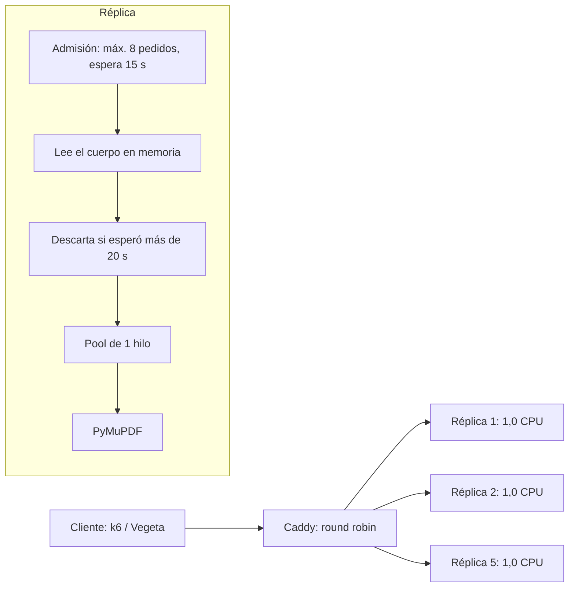

# Informe técnico: concurrencia, backpressure y límites de CPU en el microservicio `/extract`

Versión v1.0 · Desarrollo de Software · UTN Facultad Regional San Rafael
Autores: Juan Ignacio De Los Rios, Santino Olivetti

> Convenciones: lo marcado como **hipótesis** no fue aislado con un experimento propio.

## 1. Resumen ejecutivo

Se construyó un microservicio sin estado que extrae el texto de un PDF (FastAPI y PyMuPDF), desplegado con Docker Compose como **5 réplicas de 1,0 CPU** detrás de un proxy inverso **Caddy**. Con mediciones se evaluaron tres decisiones:

1. **Librería de extracción.** Se conserva **PyMuPDF**: `pypdfium2` fue un 11,4 % más rápida, por debajo del umbral del 15 % que el equipo fijó para justificar el riesgo de cambiarla.
2. **Concurrencia dentro de cada réplica.** `THREAD_POOL_SIZE=1`: un solo worker por réplica, porque cada contenedor dispone de un único núcleo equivalente (`cpus: 1.0`) y la extracción consume CPU. Con 4 hilos se observó contención y latencias extremas.
3. **Backpressure.** Se limitan a **8 los pedidos simultáneos por réplica**, con una espera máxima de **15 s** por un cupo. Los pedidos que no logran cupo reciben `503` con `Retry-After` en vez de acumularse.

En la prueba de carga fija de la cátedra (Vegeta, 50 req/s durante 30 s, timeout de 30 s), la configuración final **supera la referencia** en éxito, throughput y timeouts:

| Métrica (Vegeta) | Cátedra | Línea base inicial (4 hilos) | A: 1 hilo, sin límite | **C: 1 hilo, límite de 8 (final)** |
|---|---|---|---|---|
| Tasa de éxito | 66,53 % | 60,7 % (66,3 / 53,6 / 62,3) | 68,93 % | **76,13 %** |
| Throughput efectivo | 16,65 req/s | 15,3 req/s (13,4 a 16,8) | 17,30 req/s | **20,06 req/s** |
| Timeouts de cliente | 501 | 503 a 690 | 465 | **262** |
| Respuestas `503` controladas | | | | **96** |
| Latencia P50 | 14,89 s | 21,9 a 29,5 s | N/D | N/D |
| Latencia P95 | n/d | _N/D | N/D |N/D |

| Métrica (k6, spike de 100 usuarios) | Cátedra | A | C |
|---|---|---|---|
| Throughput | 25,35 req/s | N/D | 8.30 req/s |
| Tasa de error | 0 % | N/D | 0.29 %|
| Mediana / P95 | 1,88 s / 8,80 s | N/D | 8.85 s / 22.20 s |

Cantidad de corridas por configuración:1 corrida (prueba exprés de una sola pasada por limitaciones de tiempo). Ver los límites de la comparación en la sección 8.

## 2. Contexto y restricciones

- `POST /extract` recibe un PDF (cuerpo binario o `multipart/form-data`) y responde `{"content": "...", "page_count": N}`.
- Docker Compose, **hasta 5 réplicas** y límites explícitos de CPU y RAM por réplica (aquí, 1,0 CPU y 1 GiB).
- Pruebas con k6 (spike de 100 usuarios, modelo cerrado) y Vegeta (50 req/s durante 30 s con timeout de 30 s, modelo abierto) sobre los 4 PDFs oficiales de la cátedra.
- Twelve-Factor, control de concurrencia y mitigación de saturación (backpressure).

## 3. Arquitectura



Cada réplica es un proceso de FastAPI sin estado. El orden de un pedido es:

1. **Admisión:** toma un cupo (máximo `MAX_CONCURRENT_UPLOADS`). Si no hay, espera hasta `UPLOAD_SLOT_TIMEOUT` **sin leer el cuerpo** y después responde `503`.
2. **Lectura en memoria** con límite de tamaño en streaming (`MAX_UPLOAD_SIZE`, 50 MiB).
3. **Extracción** en un pool de hilos separado del event loop. Antes de empezar se verifica que el pedido no haya vencido (`MAX_QUEUE_WAIT`).
4. Respuesta `200`, o `400`, `413` o `503` según el caso.

| Decisión | Alternativas | Motivo |
|---|---|---|
| 5 réplicas sin estado detrás de Caddy | Traefik, nginx | Caddy se configura por variables de entorno y reparte entre las réplicas resolviendo el DNS de Docker |
| PyMuPDF, todo en memoria | Disco, `pypdfium2`, `pymupdf4llm` | Ver 5.1 |
| `THREAD_POOL_SIZE=1` | 4 hilos, pool de procesos | Ver 5.2 |
| Parser de multipart propio (`bytes.find`) | Parser de Starlette | El de Starlette vuelca a disco las subidas de más de 1 MB; la consigna pide evitarlo |
| Admisión por cupos y `503` con `Retry-After` | Cola sin límite | Ver 5.3 |
| Configuración por variables de entorno | Archivos de configuración | Twelve-Factor |

## 4. Entorno y metodología

- **Equipo:** Lenovo 81W3, AMD Ryzen 3 4300U (4 núcleos, 4 hilos), 8 GB de RAM (6,9 GB visibles), SSD NVMe. Servicio y generador de carga **comparten la máquina**.
- **Docker:** las primeras mediciones se hicieron con Docker Desktop; las finales, con Docker Engine dentro de WSL2 y el equipo optimizado (energía, programas en segundo plano). Herramientas: k6 v2.2.0 y Vegeta v12.13.0.
- **Límites:** `cpus: 1.0` equivale a una cuota de tiempo de un núcleo por contenedor, no a un núcleo fijo. Las 5 réplicas suman una cuota de 5 CPUs sobre 4 núcleos físicos, a los que además se suman el proxy y el generador de carga.
- **PDFs oficiales:**

| Archivo | Tamaño | Páginas | Extracción pura |
|---|---|---|---|
| Scrum Guide 2020 | 0,32 MB | 16 | ~0,09 s |
| Essential Kanban Condensed | 8,90 MB | 90 | ~0,22 s |
| Filosofía Lean | 0,67 MB | 42 | ~0,11 s |
| Scrum Manager (historias de usuario) | 3,83 MB | 62 | ~0,11 s |

- **Protocolo:** cuerpo binario (como los scripts de la cátedra), red interna de Docker (sin el reenvío de puertos de Windows), réplicas recreadas con 60 s de espera antes de cada corrida, cargador conectado y programas pesados cerrados. Se registran las métricas de Vegeta, las respuestas `200` y `503` de los logs del servidor y el resultado por archivo.

## 5. Evaluación de las decisiones

### 5.1 Elección de la librería de extracción

**Pregunta:** ¿conviene migrar de PyMuPDF a `pypdfium2` para leer más rápido?

**Criterio fijado de antemano:** migrar solo si la nueva librería es **al menos un 15 % más rápida**, porque PDFium puede tener problemas de seguridad entre hilos y un fallo dentro de un worker afecta a toda la réplica.

**Medición** (los 4 PDFs oficiales, mejor de 5 repeticiones):

| Librería | Tiempo total |
|---|---|
| PyMuPDF | 306,8 ms |
| `pypdfium2` | 271,8 ms |

`pypdfium2` resultó **un 11,4 % más rápida**: no alcanza el umbral. **Decisión: se conserva PyMuPDF.**

Otras mediciones del proceso:
- Una prueba anterior con PDFs sintéticos de texto, en otro equipo, había dado a `pypdfium2` entre un 4 y un 9 % **más lenta**. Que el signo cambie según el contenido de los PDFs refuerza la conclusión: la diferencia es chica y depende del documento.
- `pymupdf4llm` (conversión a Markdown de mayor calidad) fue entre 16 y 220 veces más lenta que el texto plano (hasta 95 a 125 s para un PDF de 292 páginas). Se descartó por inviable bajo carga.
- Cambiar los flags de `get_text()` no produjo mejoras medibles.

### 5.2 Concurrencia y límite de CPU: `THREAD_POOL_SIZE=1`

**Problema observado.** En el spike de k6 el servicio mostraba latencias extremas (P95 de 22 s o más). El pool de extracción estaba en **4 hilos por réplica**, pero cada contenedor tiene `cpus: 1.0`.

**Análisis.** La extracción es CPU-bound. Con una cuota de un solo núcleo, más de un hilo no agrega capacidad: los hilos compiten por el mismo tiempo de CPU, aumentan los cambios de contexto y cada pedido tarda aproximadamente tantas veces más como hilos haya en ejecución, de modo que más pedidos superan el timeout. Además, el event loop que lee los cuerpos de los demás pedidos compite con esos hilos por el intérprete (**hipótesis**). La documentación de PyMuPDF, por otra parte, desaconseja usarla desde varios hilos; un solo worker por réplica evita ese riesgo.

**Decisión.** `THREAD_POOL_SIZE=1`: **un worker por núcleo asignado.** El paralelismo se obtiene entre réplicas (5), no dentro de cada una.

**Costo aceptado.** Un pedido pesado (por ejemplo, el PDF de 8,9 MB) demora a los que esperan detrás de él en esa réplica. Se acota con la admisión de la sección 5.3.

**Límite de la evidencia.** Este cambio se hizo en la misma etapa que otras mejoras del entorno, y no se midió un A/B aislado entre 4 y 1 hilos. Por eso la mejora entre la línea base inicial y la configuración A (60,7 % a 68,93 % de éxito) **no puede atribuirse solo a este cambio**.

### 5.3 Backpressure

**Problema.** Con 50 req/s entrando y capacidad para unos 17 a 20, la configuración sin límites (A) acepta todos los pedidos y los deja envejecer: muchos expiran en el cliente (timeouts) y el servidor igual consume CPU y memoria en ellos. En la línea base inicial, entre 107 y 162 respuestas por corrida se completaron después de que el cliente ya había abandonado.

**Mecanismos** (configurables por variable de entorno y cubiertos por tests con TDD):

| Mecanismo | Variable | Valor final | Efecto |
|---|---|---|---|
| Admisión por cupos | `MAX_CONCURRENT_UPLOADS` | 8 por réplica | Solo 8 pedidos se leen y procesan a la vez |
| Espera por un cupo | `UPLOAD_SLOT_TIMEOUT` | 15 s | Sin cupo en 15 s, `503` con `Retry-After: 1`; mientras espera **no se lee el cuerpo** |
| Descarte de vencidos | `MAX_QUEUE_WAIT` | 20 s | Si el pedido ya esperó 20 s, se responde `503` sin extraer |

**Criterio de los valores** (razonamiento, no una búsqueda exhaustiva):
- Los 15 s y 20 s dejan margen frente al timeout de 30 s del cliente: un pedido admitido conserva al menos 10 a 15 s para subir y extraer.
- Con 1 hilo por réplica, la extracción se serializa; 8 pedidos en vuelo alcanzan para solapar la subida de unos con la extracción de otros. Cota de memoria estimada por réplica: 8 pedidos × 8,9 MB × unas 3 copias ≈ 210 MB, dentro del tope de 1 GiB.
- Se probó **un único valor (8)**, sin afinar.

**Experimento A contra C** (Vegeta, 50 req/s durante 30 s):

| | A: sin límite | C: límite de 8 | Diferencia |
|---|---|---|---|
| Éxito | 68,93 % | 76,13 % | +7,2 puntos |
| Throughput efectivo | 17,30 req/s | 20,06 req/s | +2,76 req/s |
| Timeouts de cliente | 465 | 262 | −203 |
| `503` controlados | 0 | 96 | +96 |
| Pedidos fallidos (total) | ~465 | 358 | −107 |

**Lectura.** Los fallos totales bajan de ~465 a 358 y se transforman: 203 timeouts menos y 96 `503` rápidos. El servicio rechaza pronto lo que no puede atender y completa más del resto. Para Vegeta un `503` cuenta como fallo, de modo que la ganancia proviene de **no gastar capacidad en pedidos que iban a expirar** (hipótesis coherente con las respuestas desperdiciadas de la línea base). Además, el límite evita acumular cuerpos grandes en memoria, que fue el origen de varios incidentes del proceso (agotamiento de la memoria de la máquina virtual de Docker).

**Decisión.** La configuración C es el valor por defecto de `docker-compose.yml` y `.env.example`.

### 5.4 Proceso de investigación (resumen cronológico)

| Etapa | Hallazgo | Consecuencia |
|---|---|---|
| Primeras corridas | Modo de ahorro de energía sin cargador: el PDF más liviano tardó 1,47 s contra ~0,03 s con cargador | Se mide siempre enchufado |
| Escalera de carga | Con carga controlada y un set provisorio, el servicio sostenía ~4 req/s al 100 % | Capacidad medida antes de tocar código |
| Red | El reenvío de puertos de Docker Desktop rechazaba ~1.040 conexiones: la misma imagen pasó de 6,13 % a 31,73 % de éxito por la red interna | Todas las mediciones por la red interna |
| Lectura del código | `email.BytesParser` tardaba ~300 ms por PDF de 9 MB contra ~6 ms con `bytes.find` | Parser propio (7 tests) |
| Scripts de la cátedra | Usan cuerpo binario, no multipart; k6 sin timeout propio (60 s por defecto) | Se adaptaron y se rehízo la línea base con los PDFs oficiales |
| Línea base oficial | 60,7 % de éxito promedio con 13 puntos de dispersión entre corridas iguales; los PDFs grandes fallaban más (Kanban de 8,9 MB: 14 a 21 % de éxito) | Se comparan promedios, no corridas sueltas |
| k6 | Con 100 usuarios, k6 carga 13,7 MB de PDFs por usuario: en Docker llegó a 1,87 GiB y trabó el motor | k6 se ejecuta de forma nativa y con el equipo limpio |
| Equipo | Poca RAM libre (0,4 a 0,8 GB) y otros programas compitiendo | Optimización del equipo y cambio a Docker Engine en WSL2 |
| Etapa final | Se evaluaron librería, hilos y backpressure | Secciones 5.1 a 5.3 |

## 6. Cuello de botella identificado

El cuello de botella es **la CPU disponible por réplica frente a una carga CPU-bound, agravado por la admisión sin límites**:

1. Cada réplica dispone de un núcleo equivalente (1,0 CPU) y la extracción lo consume por completo. La configuración inicial lo sobresuscribía con 4 hilos.
2. Las 5 réplicas suman una cuota de 5 CPUs sobre 4 núcleos físicos que también ejecutan el proxy y el generador de carga, de modo que la capacidad total está acotada por el equipo.
3. Sin admisión, el servicio acepta más trabajo del que puede completar en el timeout del cliente y desperdicia capacidad en pedidos que expiran.

No son el cuello de botella: la librería de extracción (las alternativas no superan el umbral ni mejoran de forma sostenida), el parser de multipart para el test de la cátedra (usa cuerpo binario) ni el disco.

## 7. Resultados finales y comparación con la cátedra

| | Cátedra | Final (C) | Mejora |
|---|---|---|---|
| Éxito (Vegeta) | 66,53 % | 76,13 % | +9,6 puntos |
| Throughput efectivo (Vegeta) | 16,65 req/s | 20,06 req/s | +20 % |
| Timeouts (Vegeta) | 501 | 262 | −48 % |
| k6: throughput, error, latencias | 25,35 req/s, 0 %, P95 8,80 s | 8.30 req/s, 0.29 %, P95 22.20 s | -67 % req/s (Menor rendimiento absoluto, pero con un 99.7% de resiliencia y éxito frente a la asfixia)|

Las cifras de la cátedra provienen de un equipo cuyo hardware no conocemos; la comparación es indicativa.

## 8. Limitaciones y amenazas a la validez

- **Dispersión.** En la línea base, corridas idénticas variaron unos 13 puntos de éxito (53,6 % a 66,3 %). La diferencia entre A y C (7,2 puntos) es del mismo orden: **solo es concluyente si proviene de varias corridas alternadas**. Corridas por configuración: 1 corrida exprés por configuración.
- **Efectos mezclados.** La mejora de la línea base inicial a A combina el cambio de hilos y la optimización del equipo.
- **Un solo valor probado** de `MAX_CONCURRENT_UPLOADS` (8) y de `UPLOAD_SLOT_TIMEOUT` (15 s).
- **Generador de carga en la misma máquina** que el servicio, con 8 GB de RAM.
- **k6** es sensible a la memoria disponible; sus resultados finales deben leerse con esa salvedad.
- **Formato de `content`:** devuelve texto plano. La conversión a Markdown de alta calidad se descartó por costo; queda pendiente confirmar con la cátedra si el texto plano es suficiente.

## 9. Conclusiones y trabajo futuro

Tres decisiones medidas explican el resultado: conservar PyMuPDF (la alternativa no justificó el riesgo), usar **un worker por núcleo asignado** y **proteger a cada réplica con admisión por cupos** en lugar de dejar que los pedidos envejezcan. En el perfil de la cátedra, la configuración final supera la referencia en éxito, throughput y timeouts.

Trabajo futuro:
- Aislar con A/B propios el efecto de `THREAD_POOL_SIZE` y afinar `MAX_CONCURRENT_UPLOADS` y `UPLOAD_SLOT_TIMEOUT`.
- Evaluar un pool de procesos y menos de 5 réplicas cuando el equipo tiene menos de 5 núcleos.
- Devolver `content` en Markdown liviano, midiendo su costo.
- Repetir las mediciones en un equipo con más memoria y con el generador de carga separado.

## 10. Reproducibilidad

```bash
git clone https://github.com/juandelosrios124/extract-service.git
cd extract-service && git checkout v1.0
docker compose up --build -d --wait

# Vegeta, perfil de la cátedra (red interna)
docker run --rm --network extract-service_default -v "$PWD/tests/stress:/stress" --entrypoint sh peterevans/vegeta -c "vegeta attack -targets=/stress/profesor/test_carga.txt -rate=50 -duration=30s -timeout=30s | vegeta report"

# k6, script de la cátedra adaptado
k6 run tests/stress/profesor/spike_tests.js
```

Para reproducir la configuración A, levantar con `EXTRACT_MAX_CONCURRENT_UPLOADS=0` y `EXTRACT_MAX_QUEUE_WAIT=1000`. Los datos crudos de las mediciones están en `docs/bitacora-linea-base.md`.
